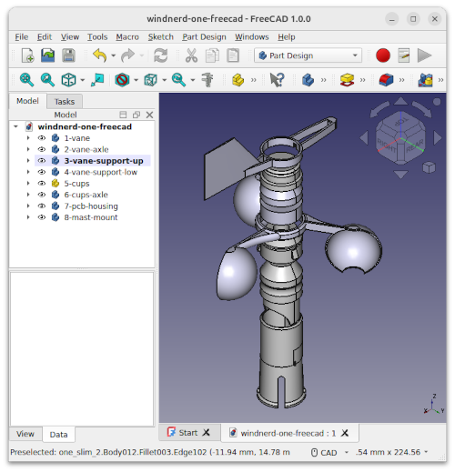

# Windnerd One 3D files
This repository contains the 3D models for the [Windnerd One Kit](https://windnerd.net/en/shop), a connected wind measurement device you can print and customize.

## STL - 3D printing
Can be opened with a slicer like Ultimate Cura or Bambu Studio.
Check out the [printing guide](https://windnerd.net/docs/windnerd-one/3d-printing) 

## FCstd - CAD
Can be opened and edited with FreeCAD, a free and open-source parametric CAD tool.

© 2025 Windnerd.
All files are openly licensed via [CC BY-SA 4.0] (https://creativecommons.org/licenses/by-sa/4.0/)
