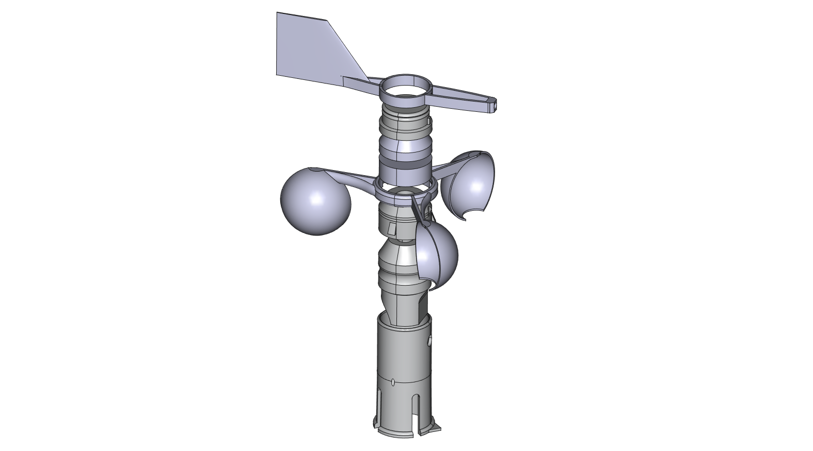
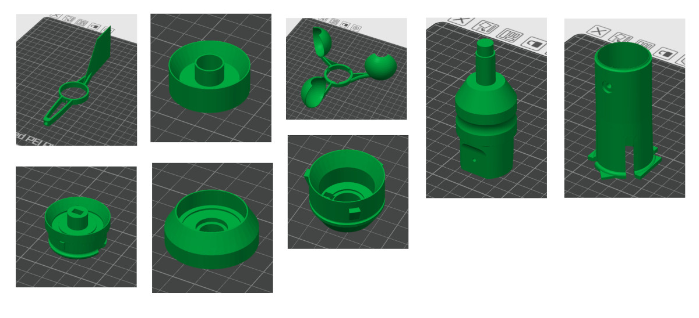
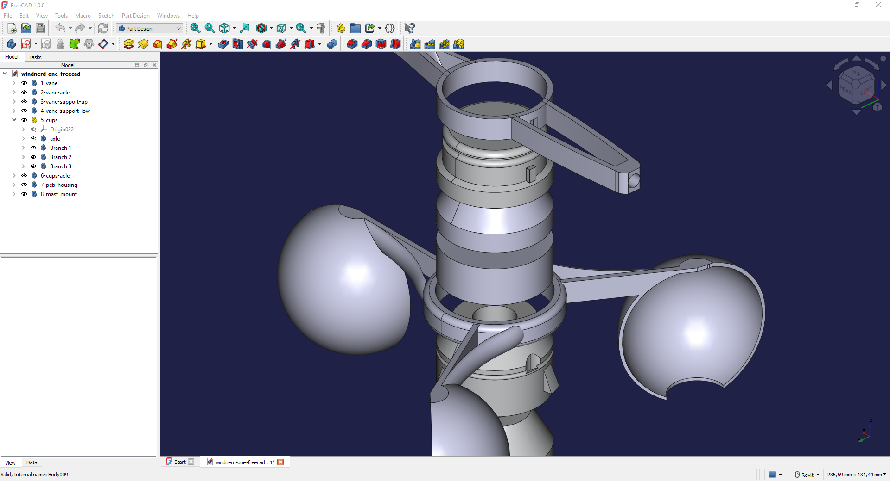

# 3D files for WindNerd One - WiFi Anemometer

WindNerd One is a WiFi wind meter, purposefully engineered for 3D printing and real-world use.
This repository includes the complete set of STL files for printing your own WindNerd One, along with the original **FreeCAD source file** you can edit to suit your needs.

### Features

- Easy to print in **PETG**, no supports required
- Modular and maintainable, the most exposed parts are easily replaceable
- Fits common 6001 standard bearings
- No wiring or mechanical contacts, sensing is **fully magnetic** using Hall ICs on single integrated PCB

The electronics and additional hardware are [**available as a kit**](https://windnerd.net/en/shop)

## STL - 3D printing
Can be opened with a slicer like Ultimate Cura or Bambu Studio.
Check out the [printing guide](https://windnerd.net/docs/windnerd-one/3d-printing) 

## CAD (FCStd, FreeCAD)
Can be opened and edited with FreeCAD, a free and open-source parametric CAD tool.

© 2025 Windnerd.
All files are openly licensed via [CC BY-SA 4.0](https://creativecommons.org/licenses/by-sa/4.0/)
